# JavaFX

>>Examples for all JavaFX components. Almost everything you will need to build a GUI is here for your reference. 

---

#### Note

- Allot of the files have commented out code, this is because I could not implement different projects for all views and components of JavaFX.
They are all working, pls un-comment this and comment the current parts and run the program to view. 
- If the code is not working, pls confirm that you have the JavaFX libraries in your IDE. If not then pls import them to the project, or add them to the IDE.

---
### [1. Hello World](01.Hello-World-FX/src/sample)

This is a basic program 'Hello World'. 

---

### [2. GridPlane & HBox](02.GridPlane-&-HBox/src/sample)

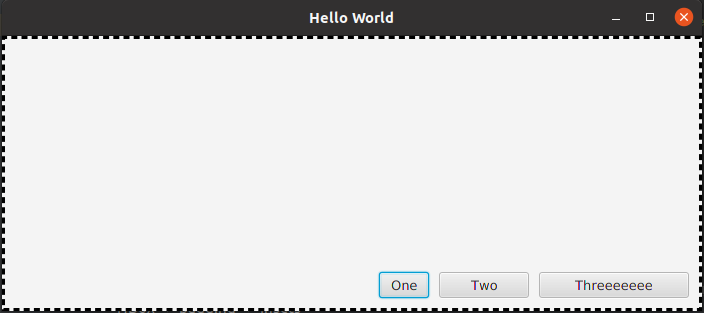

This will show an example of GridPlane and HBox. To run the GridPlane pls un-comment the code and comment the HBox part. 

---

### [03. BorderPane Layout](03.BorderPane-Layout/src/sample)

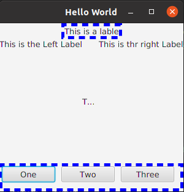

Here we can see an example of a BorderPane. The different sections are separated by lines as seen. We can also nest one view/pane in another. For the BorderPane, the center will take up any leftover space. 

---

### [04. FlowPane TilePane StackPane](04.FlowPane-TilePane-StackPane/src/sample)

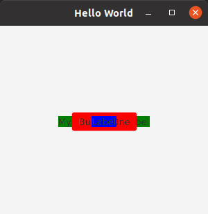

Pls, edit the commenting to view different JavaFX components. Here you can also see which component will cover which one. Knowing this helps to have a good understanding of JavaFX and how it works. 

---

### [05. Button & Image](05.Button-&-Image/src/sample)

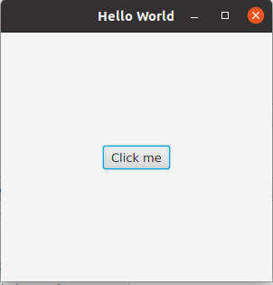

The image here is not working and is commented out. This is due to my PC though and it should work on another IDE. Pls do try and run the application with this part not commented.

---

### [06. All Button Font Styling All Other Controls](06.All-Buttons-Font-Styling-All-Other-Controls/src/sample)

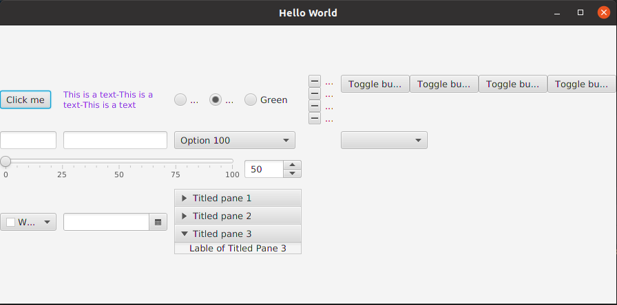

This application shows us the use of Button, Label, Changing text style, ToggleGroup, RadioButton, CheckBox, ToggleButton, TextField, PasswordField, ChoiceBox, Slider, Spinner, ColorPicker, DatePicker, Accordion.

---

### [07. Event Handelers](07.Event-Handelers/src/sample)

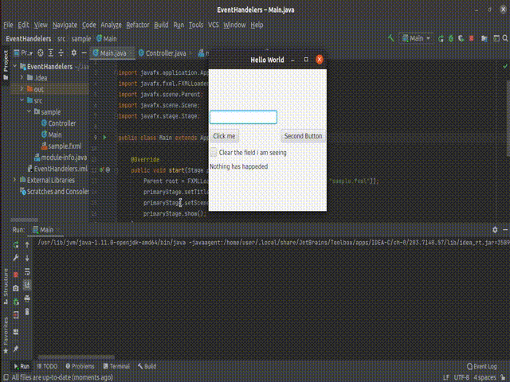

Whenever we click a button or select something we can trigger an event in the controller. This project will show you an example of event handlers. 

---

### [08. JavaFX CSS](08.JavaFX-CSS/src/sample)

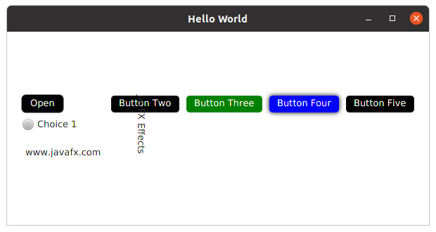

This project will show you a small way in which you could use CSS in your GUI application. You can also see how a link is added. 

---

### [09. Scene builder](09-Scene-builder/src/sample)

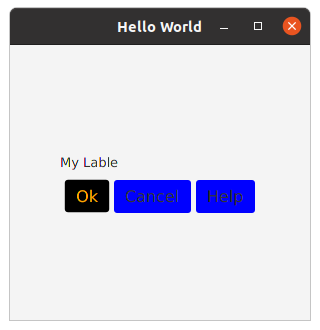

This is am an example of what a .fxml file will look like if built with Scene Builder. The Scene Builder adds a lot of not-needed code and could be confusing at times. 

---

### [10 Todo List](10-To-Do-List/src/javafx/toDoList)

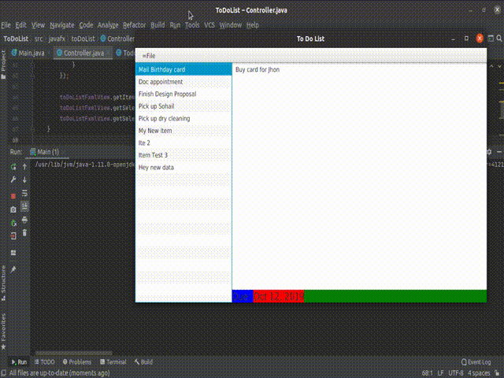

This is an application that will track a list of things to do. We can add new items. There are 2 controllers and 2 .fxml files these are for the main window and the dialogue box to add new items. The data is stored in a text file. Currently, the data is being updated every time through code when it is changed. In the next part, you can see the data and view have been bound, i.e. the view will automatically update when data is added or deleted. This is a faster and better method to update the view.

---

### [11 To Do List Data Binding](11-To-Do-List-Data-Binding/ToDoList/src/javafx/toDoList)

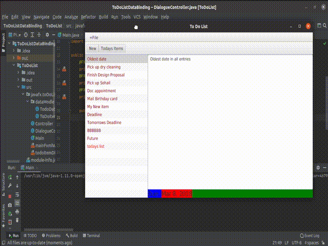

This is a development on the previous project and here we have used data binding. 

---

### [12. Contacts Book Application](12.Contacts-Application/src/sample)

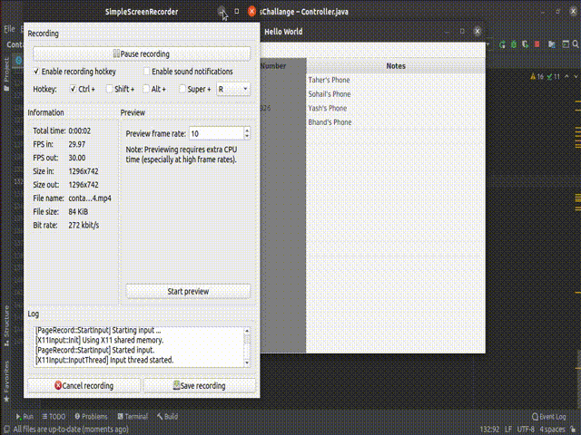

This is an implementation of an address book in java. We can update, delete, and add new contacts. This has most of the above concepts used in it. 

